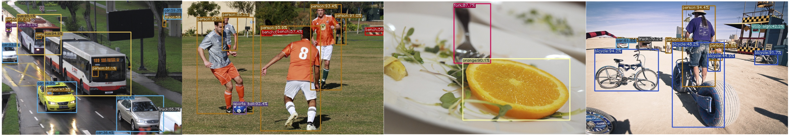

<div align="center"></div>


## YOLOX + Quantization Aware Training + Knowledge Distillation

This repository extends [YOLOX](https://github.com/Megvii-BaseDetection/YOLOX) (an anchor-free, high-performance YOLO variant) with:

- **Quantization Aware Training (QAT)** — train with fake-quantize nodes to produce deployment-ready INT8 models
- **Knowledge Distillation** — transfer knowledge from a larger teacher to a smaller student via feature + logit matching
- **Combined QAT + Distillation** — the best of both: quantize the student while it learns from a full-precision teacher

Based on [YOLOX: Exceeding YOLO Series in 2021](https://arxiv.org/abs/2107.08430) by Megvii.

---

## Table of Contents

- [Benchmark](#benchmark)
- [Installation](#installation)
- [Quick Start](#quick-start)
- [Quantization Aware Training (QAT)](#quantization-aware-training-qat)
- [Knowledge Distillation](#knowledge-distillation)
- [Combined QAT + Distillation](#combined-qat--distillation)
- [Export Quantized Model](#export-quantized-model)
- [Architecture Overview](#architecture-overview)
- [Configuration Reference](#configuration-reference)
- [Original YOLOX Training](#original-yolox-training)
- [Deployment](#deployment)
- [Citation](#citation)

---

## Benchmark

#### Standard Models

| Model | Size | mAP<sup>val</sup> | mAP<sup>test</sup> | Speed V100 (ms) | Params (M) | FLOPs (G) | Weights |
|-------|:----:|:------------------:|:-------------------:|:----------------:|:----------:|:---------:|:-------:|
| [YOLOX-s](./exps/default/yolox_s.py) | 640 | 40.5 | 40.5 | 9.8 | 9.0 | 26.8 | [download](https://github.com/Megvii-BaseDetection/YOLOX/releases/download/0.1.1rc0/yolox_s.pth) |
| [YOLOX-m](./exps/default/yolox_m.py) | 640 | 46.9 | 47.2 | 12.3 | 25.3 | 73.8 | [download](https://github.com/Megvii-BaseDetection/YOLOX/releases/download/0.1.1rc0/yolox_m.pth) |
| [YOLOX-l](./exps/default/yolox_l.py) | 640 | 49.7 | 50.1 | 14.5 | 54.2 | 155.6 | [download](https://github.com/Megvii-BaseDetection/YOLOX/releases/download/0.1.1rc0/yolox_l.pth) |
| [YOLOX-x](./exps/default/yolox_x.py) | 640 | 51.1 | **51.5** | 17.3 | 99.1 | 281.9 | [download](https://github.com/Megvii-BaseDetection/YOLOX/releases/download/0.1.1rc0/yolox_x.pth) |

#### Light Models

| Model | Size | mAP<sup>val</sup> | Params (M) | FLOPs (G) | Weights |
|-------|:----:|:------------------:|:----------:|:---------:|:-------:|
| [YOLOX-Nano](./exps/default/yolox_nano.py) | 416 | 25.8 | 0.91 | 1.08 | [download](https://github.com/Megvii-BaseDetection/YOLOX/releases/download/0.1.1rc0/yolox_nano.pth) |
| [YOLOX-Tiny](./exps/default/yolox_tiny.py) | 416 | 32.8 | 5.06 | 6.45 | [download](https://github.com/Megvii-BaseDetection/YOLOX/releases/download/0.1.1rc0/yolox_tiny.pth) |

---

## Installation

```bash
git clone https://github.com/Megvii-BaseDetection/YOLOX.git
cd YOLOX
pip install -v -e .
```

**Requirements:** PyTorch >= 1.8, Python >= 3.7. Full list in [requirements.txt](./requirements.txt).

---

## Quick Start

```bash
# Download a pretrained model (e.g. YOLOX-S)
wget https://github.com/Megvii-BaseDetection/YOLOX/releases/download/0.1.1rc0/yolox_s.pth

# Run inference
python tools/demo.py image -n yolox-s -c yolox_s.pth \
    --path assets/dog.jpg --conf 0.25 --nms 0.45 --tsize 640 --save_result
```

---

## Quantization Aware Training (QAT)

QAT inserts fake-quantize observers into the model during training so that the final INT8 model closely matches float accuracy. This is the preferred method for deploying YOLOX on edge devices with integer-only inference engines (TensorRT INT8, ONNX Runtime QDQ, mobile NPUs).

### How it works

```
Epoch 0 .. W-1    Calibration   — FakeQuant OFF, observers collect activation statistics
Epoch W .. F-1    QAT training  — FakeQuant ON,  observers still updating
Epoch F .. end    Freeze        — FakeQuant ON,  observers frozen (stable quantization ranges)
```

### Usage

```bash
# Fine-tune pretrained YOLOX-S with QAT (30 epochs by default)
python tools/train_qat.py \
    -f exps/default/yolox_s_qat.py \
    -c yolox_s.pth \
    -d 1 -b 16 --fp16

# Override schedule via CLI
python tools/train_qat.py \
    -f exps/default/yolox_s_qat.py \
    -c yolox_s.pth \
    -d 8 -b 64 --fp16 \
    qat_start_epoch 3 observer_freeze_epoch 20 max_epoch 30
```

### QAT Config ([`exps/default/yolox_s_qat.py`](./exps/default/yolox_s_qat.py))

| Parameter | Default | Description |
|-----------|---------|-------------|
| `qat_backend` | `"fbgemm"` | Quantization backend (`"fbgemm"` for server, `"qnnpack"` for mobile) |
| `qat_start_epoch` | `2` | Epoch to enable FakeQuantize |
| `observer_freeze_epoch` | `25` | Epoch to freeze observer statistics (-1 = never) |
| `max_epoch` | `30` | Total training epochs |
| `basic_lr_per_img` | `0.001/64` | Lower LR for QAT fine-tuning |

---

## Knowledge Distillation

A larger pretrained teacher (e.g. YOLOX-L) guides a smaller student (e.g. YOLOX-S) by matching both intermediate features and output logits. This improves student accuracy beyond what training from scratch can achieve.

### Distillation losses

| Loss | What it matches | Method |
|------|----------------|--------|
| **Feature distillation** | FPN feature maps (P3, P4, P5) | Normalized L2 with 1x1 channel adaptation |
| **Classification KD** | Head cls logits | Temperature-scaled KL divergence |
| **Objectness KD** | Head obj logits | BCE with teacher sigmoid targets |
| **Regression KD** | Head reg logits | L1 loss |

### Usage

```bash
# Distill YOLOX-L teacher into YOLOX-S student
python tools/train_distill.py \
    -f exps/default/yolox_s_distill.py \
    -d 1 -b 16 --fp16 \
    teacher_ckpt /path/to/yolox_l.pth

# Feature-only distillation (no logit KD)
python tools/train_distill.py \
    -f exps/default/yolox_s_distill.py \
    -d 8 -b 64 --fp16 \
    teacher_ckpt /path/to/yolox_l.pth \
    distill_strategy feature feature_weight 1.0
```

### Distillation Config ([`exps/default/yolox_s_distill.py`](./exps/default/yolox_s_distill.py))

| Parameter | Default | Description |
|-----------|---------|-------------|
| `teacher_depth` | `1.0` | Teacher architecture depth factor |
| `teacher_width` | `1.0` | Teacher architecture width factor |
| `teacher_ckpt` | `None` | Path to teacher pretrained weights (required) |
| `distill_strategy` | `"both"` | `"feature"`, `"logit"`, or `"both"` |
| `distill_weight` | `1.0` | Global scaling factor for distillation loss |
| `feature_weight` | `0.5` | Weight for feature distillation term |
| `logit_weight` | `1.0` | Weight for logit distillation term |
| `cls_temperature` | `3.0` | Temperature for softening cls logits in KD |

---

## Combined QAT + Distillation

The most effective pipeline for producing high-quality quantized models. A full-precision teacher guides the QAT student, compensating for the accuracy loss introduced by quantization.

```bash
python tools/train_qat_distill.py \
    -f exps/default/yolox_s_qat_distill.py \
    -d 1 -b 16 --fp16 \
    teacher_ckpt /path/to/yolox_l.pth
```

See [`exps/default/yolox_s_qat_distill.py`](./exps/default/yolox_s_qat_distill.py) for the full config.

---

## Export Quantized Model

After QAT training, convert the model to a fully quantized INT8 model:

```bash
# Save quantized state dict
python tools/export_quantized.py \
    -f exps/default/yolox_s_qat.py \
    -c /path/to/qat_trained_ckpt.pth \
    --output quantized_yolox_s.pth

# Also export as TorchScript for deployment
python tools/export_quantized.py \
    -f exps/default/yolox_s_qat.py \
    -c /path/to/qat_trained_ckpt.pth \
    --output quantized_yolox_s.pth \
    --torchscript
```

---

## Architecture Overview

### Project Structure

```
YOLOXModel_Quant/
├── exps/default/
│   ├── yolox_s.py                  # Standard YOLOX-S config
│   ├── yolox_s_qat.py             # QAT config
│   ├── yolox_s_distill.py         # Distillation config
│   └── yolox_s_qat_distill.py     # Combined QAT + Distillation config
├── tools/
│   ├── train.py                    # Standard training
│   ├── train_qat.py               # QAT training
│   ├── train_distill.py           # Distillation training
│   ├── train_qat_distill.py       # Combined QAT + Distillation training
│   ├── export_quantized.py        # Export INT8 model
│   ├── eval.py                     # Evaluation
│   └── demo.py                     # Inference demo
├── yolox/
│   ├── models/
│   │   ├── yolox.py                # YOLOX model (backbone + head)
│   │   ├── yolo_pafpn.py          # PA-FPN neck
│   │   ├── yolo_head.py           # Decoupled head + SimOTA loss
│   │   ├── darknet.py             # CSPDarknet backbone
│   │   ├── qat.py                 # QAT: FakeQuant, observers, conversion
│   │   └── distillation.py        # KD: teacher-student, feature/logit loss
│   ├── core/
│   │   ├── trainer.py              # Base trainer
│   │   ├── qat_trainer.py         # QAT trainer (schedule management)
│   │   └── distill_trainer.py     # Distillation + Combined trainer
│   └── exp/
│       ├── yolox_base.py           # Base experiment class
│       ├── qat_exp.py             # QAT experiment class
│       └── distill_exp.py         # Distillation experiment classes
└── README.md
```

### Training Pipeline

```
                  ┌──────────────┐
                  │  Experiment  │  (config: depth, width, LR, schedule...)
                  │  QATExp /    │
                  │  DistillExp  │
                  └──────┬───────┘
                         │ get_model()
                         ▼
               ┌─────────────────────┐
               │   Model Wrapper     │
               │                     │
               │  QATModel           │  ← FakeQuant + observers
               │  DistillationYOLOX  │  ← teacher (frozen) + student (trainable)
               └─────────┬───────────┘
                         │ get_trainer()
                         ▼
               ┌─────────────────────┐
               │    Trainer          │
               │                     │
               │  QATTrainer         │  ← manages FakeQuant schedule per epoch
               │  DistillTrainer     │  ← logs distillation-specific losses
               │  QATDistillTrainer  │  ← both
               └─────────────────────┘
```

---

## Configuration Reference

All parameters can be overridden from the command line using `key value` pairs after the main arguments:

```bash
python tools/train_qat.py -f exps/default/yolox_s_qat.py -c ckpt.pth \
    max_epoch 50 qat_start_epoch 5 basic_lr_per_img 0.0002
```

### Common Parameters (inherited from YOLOX)

| Parameter | Default | Description |
|-----------|---------|-------------|
| `depth` | varies | Model depth factor (0.33 for S, 1.0 for L) |
| `width` | varies | Model width factor (0.50 for S, 1.0 for L) |
| `num_classes` | `80` | Number of detection classes |
| `input_size` | `(640, 640)` | Training input size |
| `max_epoch` | varies | Total training epochs |
| `basic_lr_per_img` | varies | Per-image learning rate |
| `warmup_epochs` | varies | Warmup epochs |
| `no_aug_epochs` | varies | Last N epochs without mosaic/mixup |
| `weight_decay` | `5e-4` | Optimizer weight decay |
| `eval_interval` | `5` | Evaluate every N epochs |

---

## Original YOLOX Training

<details>
<summary>Standard training (unchanged from upstream)</summary>

```bash
# Prepare COCO dataset
ln -s /path/to/your/COCO ./datasets/COCO

# Train YOLOX-S on 8 GPUs
python -m yolox.tools.train -n yolox-s -d 8 -b 64 --fp16 -o

# Evaluate
python -m yolox.tools.eval -n yolox-s -c yolox_s.pth -b 64 -d 8 --conf 0.001
```

See the [original YOLOX repo](https://github.com/Megvii-BaseDetection/YOLOX) for full documentation on standard training, multi-machine setup, custom data, and more.

</details>

---

## Deployment

1. [MegEngine in C++ and Python](./demo/MegEngine)
2. [ONNX export and ONNXRuntime](./demo/ONNXRuntime)
3. [TensorRT in C++ and Python](./demo/TensorRT)
4. [ncnn in C++ and Java](./demo/ncnn)
5. [OpenVINO in C++ and Python](./demo/OpenVINO)
6. [Accelerate with nebullvm](./demo/nebullvm)

---

## Citation

If you use this work, please cite the original YOLOX paper:

```bibtex
@article{yolox2021,
  title={YOLOX: Exceeding YOLO Series in 2021},
  author={Ge, Zheng and Liu, Songtao and Wang, Feng and Li, Zeming and Sun, Jian},
  journal={arXiv preprint arXiv:2107.08430},
  year={2021}
}
```

---

## License

This project builds on [YOLOX](https://github.com/Megvii-BaseDetection/YOLOX), originally released under the Apache 2.0 License.
